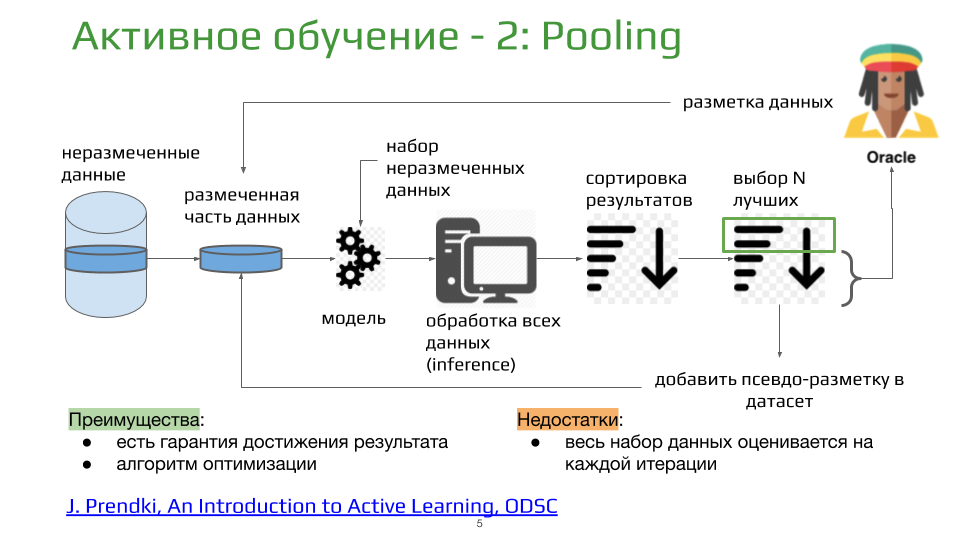

# Active Learning for Semantic Segmentation

## Installation

Install dependencies:
```bash
pip install -r requirements.txt
```
Adjust parameters in `src/params.py`.


## Simple train loop

```bash
python src/train_semantic_segmentation.py
```


## Active learning



Currently implemented anomaly detection strategies:
- Entropy sampling,
- Marging sampling,
- Query-by-committee.

Entropy and Margin samples selection:
```bash
python src/active_learning.py
```

Query-by-committee samples selection:
```bash
python src/active_learning_query_by_committee.py
```

## Reference:
- [J. Prendki, An Introduction to Active Learning, ODSC](https://opendatascience.com/an-introduction-to-active-learning/)