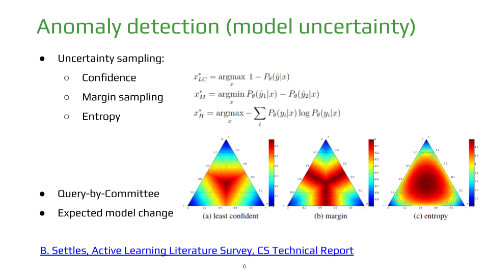

# Active Learning for Semantic Segmentation


## Installation

Install dependencies:
```bash
pip install -r requirements.txt
```
Adjust parameters in `src/params.py`.


## Simple train loop

Currently supproted datasets:

- [CamVid](http://mi.eng.cam.ac.uk/research/projects/VideoRec/CamVid/)
- [BDD](https://bdd-data.berkeley.edu/)
- [Cityscapes](https://www.cityscapes-dataset.com/)

```bash
python src/train_semantic_segmentation.py
```

## Active learning



Currently implemented anomaly detection strategies:
- Entropy sampling,
- Marging sampling,
- Query-by-committee.

Entropy and Margin samples selection:
```bash
python src/entropy_margin.py
```

Query-by-committee samples selection:
```bash
python src/query_by_committee.py
```

## Tensorboard logging

Start tensorboard, specifying the path to logging directory.
```bash
tensorboard --logdir src/tb_runs/EXPERIMENT_NAME
```

In your browser open
`http://localhost:6006`
to see the results.

## Reference:

- [J. Prendki, An Introduction to Active Learning, ODSC](https://opendatascience.com/an-introduction-to-active-learning/)
- [Active Learning  Tutorial](https://towardsdatascience.com/active-learning-tutorial-57c3398e34d)
- [B. Settles, Active Learning Literature Survey, CS Technical Report](http://burrsettles.com/pub/settles.activelearning.pdf)
- [Presentation for Cognitive](https://docs.google.com/presentation/d/1hPEoEF2r28R3TfnTWgk6VHkv9B_H4tiiWEYi-wS2U2I/edit?usp=sharing)